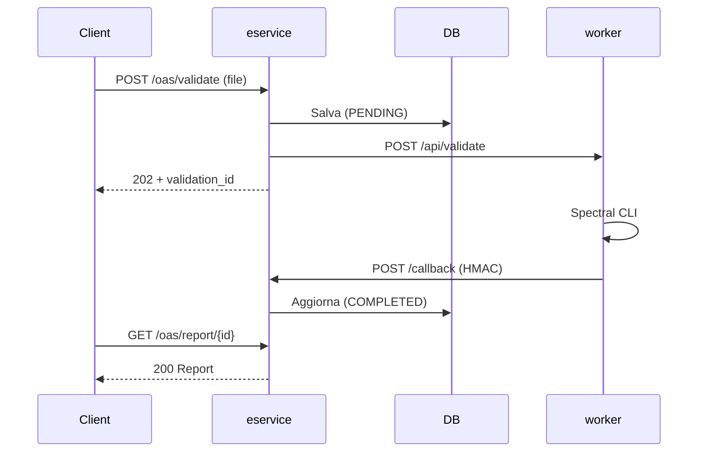

# OAS Checker E-Service

Servizio di validazione OpenAPI per la Pubblica Amministrazione italiana. Riceve file OpenAPI (YAML/JSON), li valida con [Spectral](https://stoplight.io/spectral) e restituisce un report dettagliato.

## Architettura


Il flusso e' asincrono: il client invia un file, riceve subito un `202 Accepted` con `validation_id`, e recupera il report quando pronto.



## Componenti

| Componente | Tecnologia | Descrizione |
|---|---|---|
| **eservice** | Python/FastAPI | API REST, orchestrazione, persistenza su PostgreSQL |
| **worker** | Azure Functions runtime + Spectral CLI | Esegue la validazione, restituisce il report via callback |
| **database** | PostgreSQL | File, report e metadati in campi TEXT/JSONB (storage-less) |

Il worker puo' girare come Knative Service (scale-to-zero), Deployment Kubernetes, o Azure Function esterna.

## Avvio locale

### Docker Compose

```bash
./run-oas.sh
```

Avvia eservice + worker + PostgreSQL. L'API e' disponibile su `http://localhost:8000`.

| Opzione | Default | Descrizione |
|---|---|---|
| `--mode host` | `bridge` | Rete host invece di bridge |
| `--port-api` | `8000` | Porta eservice |
| `--port-func` | `7071` | Porta worker |
| `--port-db` | `15432` | Porta PostgreSQL |

### Sviluppo senza Docker

```bash
# 1. Setup ambiente
scripts/setup.sh

# 2. Avvia PostgreSQL (serve un'istanza locale o via Docker)
docker compose up -d postgres

# 3. Avvia eservice + mock worker
scripts/start.sh

# 4. Arresta
scripts/stop.sh
```

### Test di validazione manuale

```bash
# Invia un file OpenAPI
scripts/test_validation.sh
```

## Test

```bash
# Unit + logic (senza PostgreSQL, usa SQLite)
pytest -v -m "not integration"

# End-to-End
pytest -v tests/test_e2e.py

# Integration (richiede PostgreSQL)
docker compose up -d postgres
pytest -v -m integration
```

Dettagli sulla suite di test: [tests/README.md](tests/README.md)

## Deploy Kubernetes

```bash
helm upgrade --install oas-checker \
  oci://ghcr.io/italia/api-oas-checker-eservice/charts/oas-checker \
  -n api-oas-checker --create-namespace \
  -f values.yaml
```

Il chart Helm gestisce eservice, worker (Knative/Deployment/esterno), database (in-cluster o esterno), ingress, HPA, NetworkPolicy, monitoring Prometheus e alerting.

Documentazione completa: [helm/README.md](helm/README.md)

## CI/CD

| Evento | Pipeline | Azione |
|---|---|---|
| Push/PR su `main` | CI | Test + Helm lint |
| Tag `v*` | Release | Test, build Docker (eservice + worker), push GHCR, publish Helm chart OCI |

Immagini: `ghcr.io/italia/oas-checker-eservice`, `ghcr.io/italia/oas-checker-function`

## Struttura del progetto

```
api/                Endpoint FastAPI, auth, rate limiting, exception handlers
services/           Orchestrazione validazione, client HTTP, gestione ruleset
models/             Schema Pydantic e modelli dati
database/           Repository PostgreSQL (asyncpg)
shared/             Codice condiviso tra eservice e worker (HMAC, validatore)
azure_function/     Worker Spectral (Dockerfile + Azure Functions entry point)
function_mock/      Worker mock per sviluppo locale
helm/               Chart Helm per deploy Kubernetes
scripts/            Setup, avvio locale, generazione OpenAPI, utility
tests/              Unit, integration, E2E
docs/               Documentazione tecnica
```

## Documentazione

### Operativo

| Documento | Contenuto |
|---|---|
| [docs/QUICKSTART.md](docs/QUICKSTART.md) | Avvio rapido con Docker |
| [docs/CONFIGURATION.md](docs/CONFIGURATION.md) | Variabili d'ambiente, ordine di precedenza, valori di default |
| [helm/README.md](helm/README.md) | Chart Helm: architettura, worker modes, sicurezza, HPA, monitoring, NetworkPolicy |

### Architettura e dati

| Documento | Contenuto |
|---|---|
| [docs/DATA_MODEL.md](docs/DATA_MODEL.md) | Schema PostgreSQL, persistenza validazioni e report |
| [docs/FILE_LIFECYCLE.md](docs/FILE_LIFECYCLE.md) | Ciclo di vita dei dati nel modello storage-less |
| [docs/RULESETS.md](docs/RULESETS.md) | Download e gestione dei ruleset Spectral da GitHub |
| [docs/OPENAPI_USAGE.md](docs/OPENAPI_USAGE.md) | Generazione schemi OpenAPI 3.1.0 e 3.0.3 |

### Sicurezza

| Documento | Contenuto |
|---|---|
| [docs/JWT_AUTH.md](docs/JWT_AUTH.md) | Autenticazione JWT (integrazione PDND/GovWay) |
| [docs/HMAC_CALLBACK.md](docs/HMAC_CALLBACK.md) | Firma HMAC-SHA256 delle callback worker -> eservice |
| [docs/RATE_LIMITING.md](docs/RATE_LIMITING.md) | Rate limiting per consumer, configurazione |
| [docs/GOVWAY_README.md](docs/GOVWAY_README.md) | API Gateway GovWay per conformita' ModI/PDND |

### Qualita'

| Documento | Contenuto |
|---|---|
| [tests/README.md](tests/README.md) | Suite di test: unit, integration, E2E |
| [docs/TEST_PLAN.md](docs/TEST_PLAN.md) | Piano di test e criteri di accettazione |
| [docs/SOFTWARE_INVENTORY.md](docs/SOFTWARE_INVENTORY.md) | Componenti, dipendenze e licenze |

### Componenti

| Documento | Contenuto |
|---|---|
| [azure_function/README.md](azure_function/README.md) | Worker Spectral: API, configurazione, Docker |
| [scripts/README.md](scripts/README.md) | Script di sviluppo e manutenzione |
