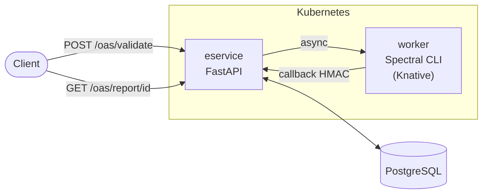
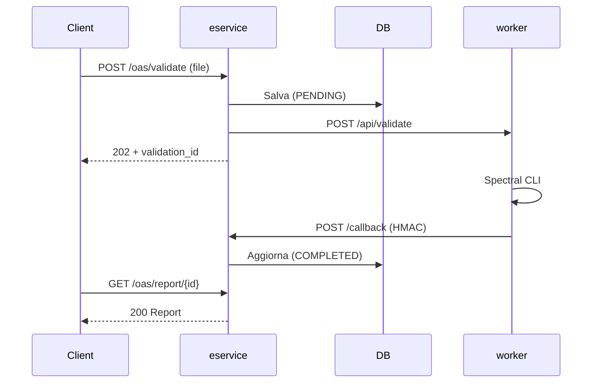

# OAS Checker E-Service

Servizio di validazione OpenAPI per la Pubblica Amministrazione italiana. Riceve file OpenAPI (YAML/JSON), li valida con [Spectral](https://stoplight.io/spectral) e restituisce un report dettagliato.

## Architettura



Il flusso e' asincrono: il client invia un file, riceve subito un `202 Accepted` con `validation_id`, e recupera il report quando pronto.



## Componenti

| Componente | Tecnologia | Descrizione |
|---|---|---|
| **eservice** | Python/FastAPI | API REST, orchestrazione, persistenza |
| **worker** | Azure Functions runtime + Spectral CLI | Esegue la validazione, restituisce il report via callback |
| **database** | PostgreSQL | File, report e metadati in campi TEXT/JSONB |

Il worker puo' girare come Knative Service (scale-to-zero), Deployment classico, o Azure Function esterna. Vedi [helm/README.md](helm/README.md).

## Quick start

### Docker Compose (sviluppo)

```bash
./run-oas.sh
```

Avvia eservice + worker mock + PostgreSQL. L'API e' disponibile su `http://localhost:8000`.

Opzioni: `--mode host`, `--port-api 8080`, `--port-func 9090`, `--port-db 15432`.

### Kubernetes (produzione)

```bash
helm upgrade --install oas-checker oci://ghcr.io/italia/api-oas-checker-eservice/charts/oas-checker \
  -n api-oas-checker --create-namespace \
  -f values.yaml
```

Documentazione completa del chart Helm: [helm/README.md](helm/README.md).

## Sviluppo

```bash
# Setup
scripts/setup.sh

# Test (unit + logic, senza PostgreSQL)
pytest -v -m "not integration"

# Test E2E
pytest -v tests/test_e2e.py
```

## CI/CD

| Evento | Pipeline | Azione |
|---|---|---|
| Push/PR su `main` | CI | Test + Helm lint |
| Tag `v*` | Release | Test, build immagini Docker (eservice + worker), push su GHCR, package e push Helm chart OCI |

Le immagini sono pubblicate su `ghcr.io/italia/oas-checker-eservice` e `ghcr.io/italia/oas-checker-function`.

## Sicurezza

- **JWT**: Autenticazione delle richieste API ([docs/JWT_AUTH.md](docs/JWT_AUTH.md))
- **HMAC-SHA256**: Firma delle callback worker -> eservice ([docs/HMAC_CALLBACK.md](docs/HMAC_CALLBACK.md))
- **Rate limiting**: Per endpoint, configurabile ([docs/RATE_LIMITING.md](docs/RATE_LIMITING.md))
- **Kubernetes**: Container non-root, filesystem read-only, NetworkPolicy, seccomp ([helm/README.md](helm/README.md#sicurezza))

## Struttura del progetto

```
api/              Endpoint FastAPI, auth, rate limiting, exception handlers
services/         Orchestrazione validazione, client HTTP, gestione ruleset
models/           Schema Pydantic e modelli dati
database/         Repository PostgreSQL (asyncpg)
shared/           Codice condiviso tra eservice e worker (HMAC, validatore)
azure_function/   Worker Spectral (Dockerfile + Azure Functions entry point)
function_mock/    Worker mock per sviluppo locale
helm/             Chart Helm per deploy Kubernetes
scripts/          Setup, avvio locale, generazione OpenAPI, utility
tests/            Unit, integration, E2E
docs/             Documentazione tecnica
```

## Documentazione

| Area | Documento |
|---|---|
| Avvio rapido | [docs/QUICKSTART.md](docs/QUICKSTART.md) |
| Configurazione (env vars) | [docs/CONFIGURATION.md](docs/CONFIGURATION.md) |
| Modello dati PostgreSQL | [docs/DATA_MODEL.md](docs/DATA_MODEL.md) |
| Gestione ruleset | [docs/RULESETS.md](docs/RULESETS.md) |
| Schema OpenAPI | [docs/OPENAPI_USAGE.md](docs/OPENAPI_USAGE.md) |
| Deploy Kubernetes | [helm/README.md](helm/README.md) |
| Test | [tests/README.md](tests/README.md) |
