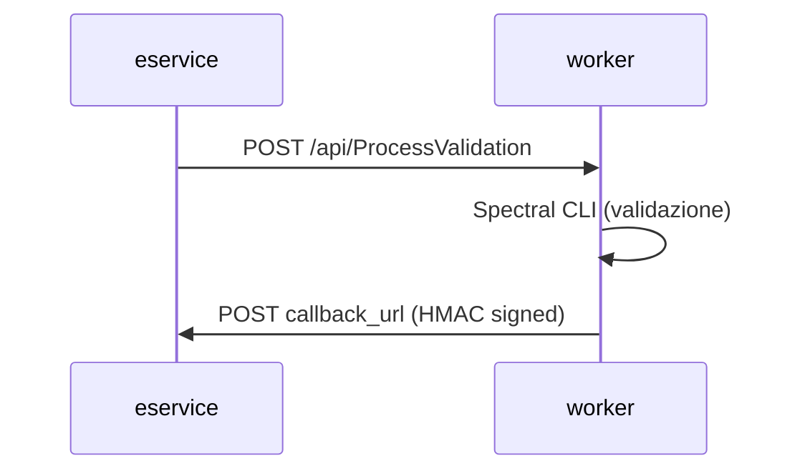

# Worker Spectral (Azure Function)

Worker asincrono per la validazione OpenAPI con [Spectral CLI](https://stoplight.io/spectral). Basato sul runtime Azure Functions ma eseguibile ovunque come container HTTP (Knative, Kubernetes, Docker).

## Flusso



Il worker riceve il contenuto del file OpenAPI, esegue Spectral, e invia il report all'eservice via callback firmata HMAC-SHA256.

## API

**POST `/api/ProcessValidation`**

```json
{
  "validation_id": "uuid",
  "file_content": "openapi: 3.0.0 ...",
  "callback_url": "http://eservice:8000/internal/callback",
  "ruleset_name": "default",
  "ruleset_content": "extends: spectral:oas ...",
  "errors_only": false
}
```

La callback include gli header `X-Signature` (HMAC-SHA256) e `X-Timestamp`.

## Configurazione

| Variabile | Descrizione | Default |
|---|---|---|
| `CALLBACK_SECRET` | Chiave HMAC per firmare le callback | (obbligatoria) |
| `RULESET_FUNCTIONS_PATH` | Path alle funzioni Spectral custom | `/home/site/wwwroot/data/rulesets/functions` |
| `ASPNETCORE_URLS` | Porta di ascolto | `http://+:8080` |

## Container

Il container gira come utente non-root (UID 1000) sulla porta 8080.

```bash
docker build -f azure_function/Dockerfile -t oas-checker-function .
docker run -p 8080:8080 -e CALLBACK_SECRET=secret oas-checker-function
```

## Struttura

```
ProcessValidation/    Entry point Azure Function
shared/               Validatore Spectral, HMAC, utility (condiviso con eservice)
Dockerfile            Container image (~1GB, include Node.js + Spectral CLI)
host.json             Configurazione runtime Azure Functions
```
